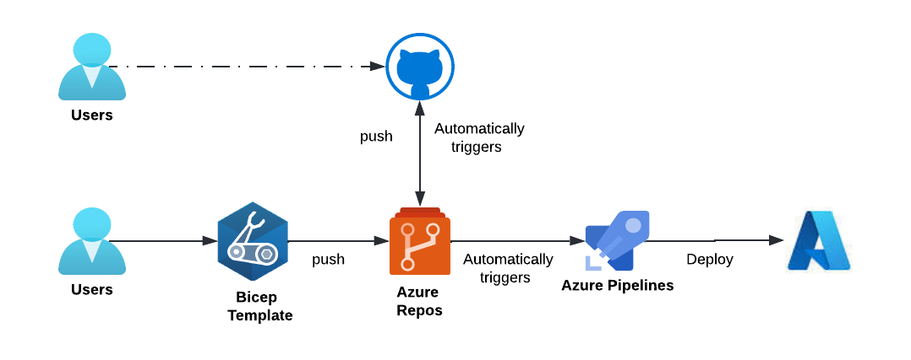

# integrate-azure-repo-with-github

# This is ongoing, not done yet!

This project has to implement in Azure DevOps and Github.

Here, we use Bicep template (with a vm resource) to deploy in Azure.

## Run
  - [Purpose](#purpose)
  - [Prerequsites](#prerequsites)
  - [Azure Repository](#azure-repository)
  - [Pipelines](#pipelines)
  - [Clean up](#clean-up)

## Purpose

For users sits/uses with github. And users sits/uses with azure repo. To accept the changes between both ends. And keep the code synced. Achievement: *SSOT*.



## Prerequsites

- [azure cli](https://learn.microsoft.com/en-us/cli/azure/install-azure-cli) & [sign in](https://learn.microsoft.com/en-us/cli/azure/authenticate-azure-cli).
- [Bicep](https://learn.microsoft.com/en-us/azure/azure-resource-manager/bicep/overview?tabs=bicep) & [Azure pipelines](https://learn.microsoft.com/en-us/azure/devops/pipelines/get-started/what-is-azure-pipelines?view=azure-devops).
- Create a resource group in Azure portal with the following command.
  
  ```
  az group create -g contoso -l northeurope
  ```

## Azure Repository
1. login to [dev.azure.com](https://azure.microsoft.com/en-us/products/devops).
2. Create **organization**, (private) **project** and **repo**. clone the repo. Follow this Ref [gudie](https://learn.microsoft.com/en-us/training/modules/build-first-bicep-deployment-pipeline-using-azure-pipelines/3-exercise-create-run-basic-pipeline).
   
   - To clone, navigate to Repos → **click**: Clone in VS Code (shown in below pic):
  

3. After cloning create a folder `deploy`. Add a file with name and code (scripted here): [azure-pipeline.yml](deploy/azure-pipeline.yml).

4. **Copy** (outside `deploy` directory): [main.bicep](main.bicep).

5. Create a folder `modules` add [vm.bicep](vm.bicep), [vnet_vpngw.bicep](vnet_vpngw.bicep).

6. Commit and push the code. The traditional way!
   
   ```hcl
   git add .
   git commit -m "first commit"
   git push
   ```

## Pipelines

1. login to [dev.azure.com](https://azure.microsoft.com/en-us/products/devops).
2. After, creating an organization (e.g: *first-org*) and (private) project (e.g: *first-project*), created in above steps.
3. Create a **service connection**:
   - In project settings (*located at bottom*) → click: **Service connections** → Create service connection → Azure Resource Manager → Service principal (automatic) → select: Subscription → Resource group: contoso → Service connection name: contoso.


> **Note**: Create a resource group in Azure portal: **contoso**. And keep service connection name: **contoso** (In [azure-pipeline.yml](deploy/azure-pipeline.yml) these variables values are predefined). And **tick**: Grant access permission to all pipelines.

4. Create a pipeline → Repository: Azure Repos Git → choose your repo → Configure your pipeline: Existing Azure Pipelines YAML file → path: `/deploy/azure-pipeline.yml` → Run pipeline.


5. Check your resources deployed using azure pipelines.
   
## Clean up
- In terminal execute the following command:
```azcli
az group delete -g "contoso" --no-wait
```
